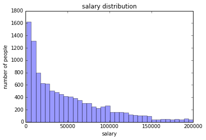
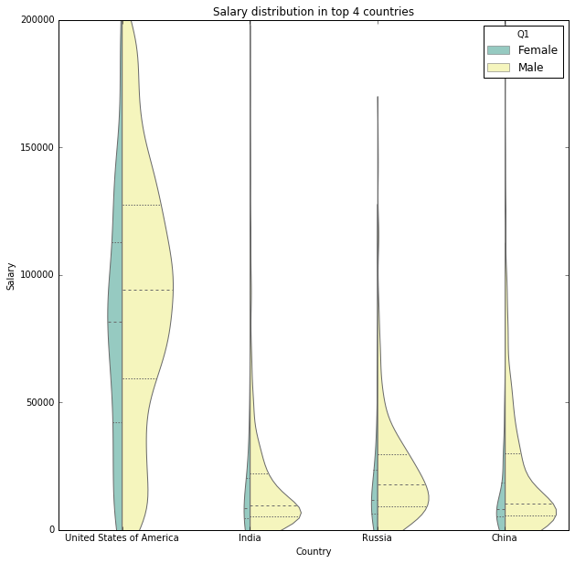
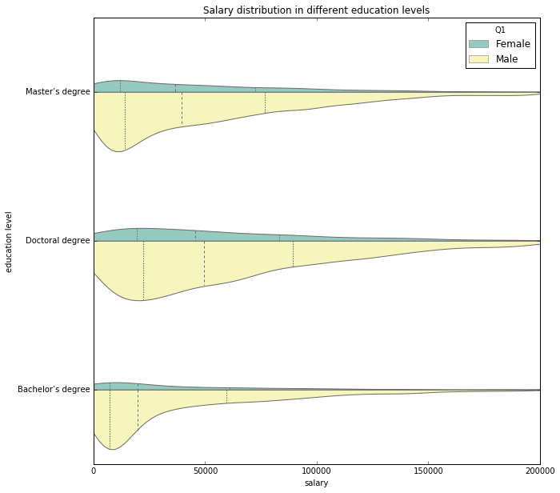
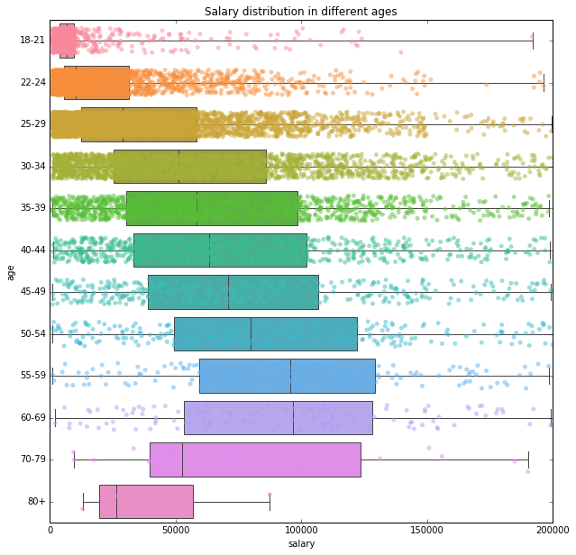
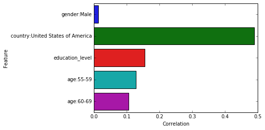

```python
# !pip install -U scikit-learn
```

# Data cleaning


```python
import numpy as np
```


```python
import pandas as pd


df_original = pd.read_csv('Kaggle_Salary.csv', low_memory=False)
df = df_original.copy()
print('Dataframe ready!')
```

    Dataframe ready!


```python
df_original.shape
```


    (15430, 397)


```python
df_test = df_original.copy()
df_test = df_test.dropna(thresh=len(df_test) - 10000, axis=1)
```


```python
df_test.shape
```


    (15430, 106)


```python
df_text_X = df_test.drop(columns=['Q9'])
```


```python
df_text_X.drop([col for col, val in df_text_X.nunique().iteritems() if val > 500], axis=1, inplace = True)
```

## Dealing with NAs

drop the first row (all the question texts):


```python
questions = df.iloc[0].to_dict()

df.drop([0], inplace=True)
```

drop columns with `OTHER_TEXT` where contents are not available:


```python
other_text = [t for t in questions if 'OTHER_TEXT' in t] 

df.drop(columns=other_text, inplace=True)
```

Drop rows with duration time less than 5 minutes:


```python
df = df[df['Time from Start to Finish (seconds)'].astype(float) > 300]
```

drop the first two colums (id and time):


```python
df.drop(df.columns[[0,1]], axis=1, inplace=True)
```

fill some NAs:


```python
df.loc[df['Q5'].isnull(), 'Q5'] = 'Other'
df.loc[df['Q10'].isnull(), 'Q10'] = 'I do not know'
df.loc[df['Q17'].isnull(), 'Q17'] = 'Other'
df.loc[df['Q18'].isnull(), 'Q18'] = 'Other'
df.loc[df['Q20'].isnull(), 'Q20'] = 'Other'
df.loc[df['Q22'].isnull(), 'Q22'] = 'Other'
df.loc[df['Q32'].isnull(), 'Q32'] = 'Other Data'
df.loc[df['Q37'].isnull(), 'Q37'] = 'Other'
```

For Q4 (education), drop those who's unwilling to answer:


```python
df = df[df.Q4 != 'I prefer not to answer']
```

For some important questions (Q8: working years, Q23-Q26: working related), drop rows with NA:


```python
df.dropna(subset=['Q8'], inplace=True)
df.dropna(subset=['Q23', 'Q24', 'Q25', 'Q26'], inplace=True)
```

For columns regarding Q12,drop part1 which is a duplicate of other parts, and transform `-1`(not selected) to `0` and non-negative values(selected) to `1`:


```python
df.drop(columns=['Q12_MULTIPLE_CHOICE'], inplace=True)

def Q12_trans(num):
    return 1 if int(num) >= 0 else 0

Q12_columns = ['Q12_Part_' + str(i) + '_TEXT' for i in range(1,6)] 
df.loc[:,Q12_columns] = df.loc[:,Q12_columns].applymap(Q12_trans)
```

For Q24 and Q25, drop rows without related experience:


```python
def judge_experience(text):
    if 'never' in text:
        return False
    else:
        return True

df = df[df.Q24.apply(judge_experience)]
df = df[df.Q25.apply(judge_experience)]
```

For Q34 and Q35, fill NAs with mean:


```python
for i in range(1,7):
    column_name = 'Q34_Part_' + str(i)
    df[column_name] = df[column_name].astype(float)
    mean = df[column_name].mean()
    df.loc[df[column_name].isnull(), column_name] = mean
```


```python
for i in range(1,7):
    column_name = 'Q35_Part_' + str(i)
    df[column_name] = df[column_name].astype(float)
    mean = df[column_name].mean()
    df.loc[df[column_name].isnull(), column_name] = mean
```

For Q39, Q40, Q41 and Q48, fill NAs with 'Unknown':


```python
df.loc[df['Q39_Part_1'].isnull(), 'Q39_Part_1'] = 'Unknown'
df.loc[df['Q39_Part_2'].isnull(), 'Q39_Part_2'] = 'Unknown'
df.loc[df['Q40'].isnull(), 'Q40'] = 'Unknown'

for i in range(1,4):
    column_name = column_name = 'Q41_Part_' + str(i)
    df.loc[df[column_name].isnull(), column_name] = 'Unknown'

df.loc[df['Q48'].isnull(), 'Q48'] = 'Unknown'
```

Drop column `Q47_Part_16` which contains custom text:


```python
df.drop(columns=['Q47_Part_16'], inplace=True)
```

After ablove cleaning, NAs are filled or dropped in some columns. Remaining NAs exist only in those columns regarding 'Select all that apply'-style questions. To verify, take a look at number of NA values each column and pay attention to those without 'Part' in questions text:


```python
null_count = df.isnull().sum(axis=0)
null_index = null_count[(null_count > 0)].index
```


```python
for i in null_index:
    if 'Part' not in i:
        print(i)
```

    Q43
    Q46


For these two questions, lots of people (about one-third) leave them blank, and they're not very important questions, so we simply drop these two columns:


```python
df.drop(columns=['Q43', 'Q46'], inplace=True)
```

**Use a new DataFrame to store all the numerical values for future use:**


```python
df2 = pd.DataFrame()
```

Transform gender to numerical value:


```python
df2['salary'] = df['Q9'].astype(float)
```

For following columns, use one-hot coding:


```python
onehot_column_dict = {
    'Q1': 'gender',
    'Q2': 'age',
    'Q3': 'country',
    'Q5': 'underground_major',
    'Q6': 'current_role',
    'Q7': 'current_industry',
    'Q8': 'current_role_years',
    'Q17': 'most_often_language',
    'Q18': 'most_recommended_language',
    'Q20': 'most_often_ML_library',
    'Q22': 'most_visualization_library',
    'Q23': 'actively_coding_time_percentage',
    'Q24': 'data_analyzing_years',
    'Q25': 'ML_years',
    'Q32': 'most_often_data_type',
    'Q37': 'most_often_online_platform',
}
onehot_columns = onehot_column_dict.keys()
onehot_prefix = [onehot_column_dict[key] for key in onehot_columns]

dummies = pd.get_dummies(df.loc[:,onehot_columns], prefix=onehot_prefix, prefix_sep=':')
df2 = pd.concat([df2,dummies], axis=1)
```

For following questions with multiple choices, assign values to them:


```python
education_level = {
    "No formal education past high school": 0,
    "Some college/university study without earning a bachelor’s degree": 1,
    "Bachelor’s degree": 2,
    "Professional degree": 3,
    "Master’s degree": 4,
    "Doctoral degree": 5
}

df2['education_level'] = df['Q4'].replace(education_level)
```


```python
ml_business = {
    'No (we do not use ML methods)': 0,
    'I do not know': 1,
    'We use ML methods for generating insights (but do not put working models into production)': 2,
    'We are exploring ML methods (and may one day put a model into production)': 3,
    'We recently started using ML methods (i.e., models in production for less than 2 years)': 4,
    'We have well established ML methods (i.e., models in production for more than 2 years)': 5
}

df2['employer_ml_implementation'] = df['Q10'].replace(ml_business)
```


```python
data_scientist_consideration = {
    'Definitely yes': 1,
    'Probably yes': 0.5,
    'Maybe': 0,
    'Probably not': -0.5,
    'Definitely not': -1
}

df2['DS_consideration'] = df['Q26'].replace(data_scientist_consideration)
```


```python
education_quility = {
    'Much better': 1,
    'Slightly better': 0.5,
    'Neither better nor worse': 0,
    'No opinion; I do not know': 0,
    'Unknown': 0,
    'Slightly worse': -0.5,
    'Much worse': -1
}
df2['Q39_Part_1'] = df['Q39_Part_1'].replace(education_quility)
df2['Q39_Part_2'] = df['Q39_Part_2'].replace(education_quility)

projects_importance = {
    'Independent projects are much more important than academic achievements': 1,
    'Independent projects are slightly more important than academic achievements': 0.5,
    'Independent projects are equally important as academic achievements': 0,
    'No opinion; I do not know': 0,
    'Unknown': 0,
    'Independent projects are slightly less important than academic achievements': -0.5,
    'Independent projects are much less important than academic achievements': -1
}
df2['Q40'] = df['Q40'].replace(projects_importance)

topic_importance = {
    'Very important': 1,
    'Slightly important': 0.5,
    'Not at all important': 0,
    'Unknown': 0.5,
    'No opinion; I do not know': 0.5
}
for i in range(1,4):
    column_name = column_name = 'Q41_Part_' + str(i)
    df2[column_name] = df[column_name].replace(topic_importance)

ml_explanibility = {
    'I am confident that I can explain the outputs of most if not all ML models': 1,
    'I am confident that I can understand and explain the outputs of many but not all ML models': 0.5,
    'I do not know; I have no opinion on the matter': 0,
    'Unknown': 0,
    'I view ML models as "black boxes" but I am confident that experts are able to explain model outputs': -0.5,
    'Yes, most ML models are "black boxes"': -1
}
df2['Q48'] = df['Q48'].replace(ml_explanibility)

```


```python
education_quility = {
    'Much better': 1,
    'Slightly better': 0.5,
    'Neither better nor worse': 0,
    'No opinion; I do not know': 0,
    'Slightly worse': -0.5,
    'Much worse': -1
}

df['Q39_Part_1'].replace(education_quility, inplace=True)
df.loc[df['Q39_Part_1'].isnull(), 'Q39_Part_1'] = 0

df['Q39_Part_2'].replace(education_quility, inplace=True)
df.loc[df['Q39_Part_2'].isnull(), 'Q39_Part_2'] = 0

projects_importance = {
    'Independent projects are much more important than academic achievements': 1,
    'Independent projects are slightly more important than academic achievements': 0.5,
    'Independent projects are equally important as academic achievements': 0,
    'No opinion; I do not know': 0,
    'Independent projects are slightly less important than academic achievements': -0.5,
    'Independent projects are much less important than academic achievements': -1
}

df['Q40'].replace(projects_importance, inplace=True)
df.loc[df['Q40'].isnull(), 'Q40'] = 0

topic_importance = {
    'Very important': 1,
    'Slightly important': 0.5,
    'Not at all important': 0,
    'No opinion; I do not know': 0.5,
}

for i in range(1,4):
    column_name = column_name = 'Q41_Part_' + str(i)
    df[column_name].replace(topic_importance, inplace=True)
    df.loc[df[column_name].isnull(), column_name] = 0.5

ml_explanibility = {
    'I am confident that I can explain the outputs of most if not all ML models': 1,
    'I am confident that I can understand and explain the outputs of many but not all ML models': 0.5,
    'I do not know; I have no opinion on the matter': 0,
    'I view ML models as "black boxes" but I am confident that experts are able to explain model outputs': -0.5,
    'Yes, most ML models are "black boxes"': -1
}

df['Q48'].replace(ml_explanibility, inplace=True)
df.loc[df['Q48'].isnull(), 'Q48'] = 0
```

For following questions, use one-hot coding:


```python
multiple_choices = {
    'Q11': ['work_activity', 7],
    'Q13': ['IDE', 15],
    'Q14': ['hosted_notebook', 11],
    'Q15': ['cloud_services', 7],
    'Q16': ['programming_language', 18],
    'Q19': ['framework', 19],
    'Q21': ['visualization', 13],
    'Q27': ['cloud_computing_products', 20],
    'Q28': ['ML_products', 43],
    'Q29': ['relational_DB', 28],
    'Q30': ['big_data_and_analytics_products', 25],
    'Q31': ['data_type', 12],
    'Q33': ['dataset_resource', 11],
    'Q36': ['course_platform', 13],
    'Q38': ['media_resource', 22],
    'Q42': ['model_metric', 5],
    'Q44': ['algorithm_difficulty', 6],
    'Q45': ['model_exploring_chances', 6],
    'Q47': ['decision_explaining_methods', 15],
    'Q49': ['reproducing_method', 12],
    'Q50': ['reproducing_barrier', 8]
}

def transform_option(df,col_name):
    col = df[col_name]
    col_new = col.notna().astype(int)
    return col_new

for q in multiple_choices:
    q_text, n = multiple_choices[q]
    for i in range(n):
        col_name = q + '_Part_' + str(i+1)
        df2[col_name] = transform_option(df, col_name)
```

For Q12, Q34 and Q35, simply copy:


```python
for i in range(1,6):
    col_name = 'Q12_Part_' + str(i) + '_TEXT'
    df2[col_name] = df[col_name]
```


```python
for i in range(1,7):
    column_name = 'Q34_Part_' + str(i)
    df2[column_name] = df[column_name]
    column_name = 'Q35_Part_' + str(i)
    df2[column_name] = df[column_name]
```

We have completed data cleaning!


```python
df = df[(df['Q9'].astype(float)<200*1000) & (df['Q9'].astype(float)>1*1000)]
df2 = df2[(df2['salary']<200*1000) & (df2['salary']>1*1000)]
```

# EDA

## Part a


```python
import seaborn as sns
import matplotlib.pyplot as plt

%matplotlib inline
```

First, take a look at the salary distribution. Since the data has a long tail (up to 600k), we pay attention to those less than 200k:


```python
salaries = df2['salary']
salaries_under_200k = salaries[salaries < 200*1000]
ax = sns.distplot(salaries_under_200k, kde=False)
ax.set_xlim(0);
ax.set_xlabel('salary')
ax.set_ylabel('number of people')
ax.set_title('salary distribution')
plt.show()
```





It can seen that the distribution is in an exponential pattern. However, is is true that the same distribution holds true for all countries and genders?

Find number of people in major countries:


```python
countries = df['Q3'].value_counts()
countries[countries>400]
```


    United States of America    2426
    India                       1511
    China                        609
    Other                        471
    Russia                       442
    Brazil                       408
    Name: Q3, dtype: int64


For the top 4 countries, look at the salary distribution:


```python
df_under_200k = df[(df['Q9'].astype(float) < 200*1000) & (df['Q9'].astype(float) > 1*1000)]

df_under_200k_four_countries = df_under_200k[df_under_200k['Q3'].isin(['China', 'India', 'United States of America', 'Russia'])]
df_under_200k_four_countries = df_under_200k_four_countries[df_under_200k_four_countries['Q1'].isin(['Male', 'Female'])]

df_under_200k_four_countries.Q9 = df_under_200k_four_countries.Q9.astype(float)

plt.subplots(figsize=(10,10))

ax = sns.violinplot(x="Q3", y="Q9", hue='Q1', data=df_under_200k_four_countries, split=True, scale='count', inner='quartiles',  palette="Set3")
ax.set_ylim(0,200*1000)
ax.set_xlabel('Country')
ax.set_ylabel('Salary')
ax.set_title('Salary distribution in top 4 countries')
plt.show()
```

    /usr/local/lib/python3.5/dist-packages/seaborn/categorical.py:647: FutureWarning: remove_na is deprecated and is a private function. Do not use.
      kde_data = remove_na(group_data[hue_mask])
    /usr/local/lib/python3.5/dist-packages/seaborn/categorical.py:895: FutureWarning: remove_na is deprecated and is a private function. Do not use.
      violin_data = remove_na(group_data[hue_mask])
    /usr/local/lib/python3.5/dist-packages/seaborn/categorical.py:915: FutureWarning: remove_na is deprecated and is a private function. Do not use.
      violin_data = remove_na(group_data)





It is shown that, of all these four countries, women have lower average salaries than men; the salaries distribution of US is in a 'spindle' shape with highest average while the distributions in other three countries come in 'long-tail' patterns.

I am also interested in salaries among people with different education levels:


```python
degrees = df_under_200k['Q4'].value_counts().index[:3]
df_under_200k_education = df_under_200k[df_under_200k['Q4'].isin(degrees)]
df_under_200k_education.Q9 = df_under_200k_education.Q9.astype(float)
df_under_200k_education = df_under_200k_education[df_under_200k_education['Q1'].isin(['Male', 'Female'])]

plt.subplots(figsize=(10,10))
ax = sns.violinplot(y="Q4", x="Q9", hue='Q1', split='True', data=df_under_200k_education, orient='h', scale='count', inner='quartiles',  palette="Set3")
ax.set_xlim(0,200*1000)
ax.set_xlabel('salary')
ax.set_ylabel('education level')
ax.set_title('Salary distribution in different education levels')
plt.show()
```

    /usr/local/lib/python3.5/dist-packages/pandas/core/generic.py:4401: SettingWithCopyWarning: 
    A value is trying to be set on a copy of a slice from a DataFrame.
    Try using .loc[row_indexer,col_indexer] = value instead
    
    See the caveats in the documentation: http://pandas.pydata.org/pandas-docs/stable/indexing.html#indexing-view-versus-copy
      self[name] = value
    /usr/local/lib/python3.5/dist-packages/seaborn/categorical.py:647: FutureWarning: remove_na is deprecated and is a private function. Do not use.
      kde_data = remove_na(group_data[hue_mask])
    /usr/local/lib/python3.5/dist-packages/seaborn/categorical.py:895: FutureWarning: remove_na is deprecated and is a private function. Do not use.
      violin_data = remove_na(group_data[hue_mask])
    /usr/local/lib/python3.5/dist-packages/seaborn/categorical.py:915: FutureWarning: remove_na is deprecated and is a private function. Do not use.
      violin_data = remove_na(group_data)





Intuitively, people with higher education level get higher average salary. Although it still holds true that men earn more than women on average in all these three levels, what worths mentioning is that, the higher education level, the bigger is the gap between genders.


```python
df_under_200k.Q9 = df_under_200k.Q9.astype(float)
df_under_200k = df_under_200k[df_under_200k['Q1'].isin(['Male', 'Female'])]

plt.subplots(figsize=(10,10))
order = ['18-21', '22-24', '25-29', '30-34', '35-39', '40-44', '45-49',
         '50-54', '55-59', '60-69', '70-79', '80+']
# ax = sns.violinplot(y="Q2", x="Q9", hue='Q1', bw=0.1, cut=0, order = order, split='True', data=df_under_200k, orient='h', scale='count', inner='quartiles',  palette="Set3")
ax = sns.stripplot(y='Q2', x='Q9', order=order, jitter=0.3, data=df_under_200k, orient='h', alpha=.5)
ax = sns.boxplot(x="Q9", y="Q2",order=order, data=df_under_200k, whis=np.inf)

ax.set_xlabel('salary')
ax.set_ylabel('age')
ax.set_title('Salary distribution in different ages')
ax.set_xlim(0,200*1000)
plt.show()
```

    /usr/local/lib/python3.5/dist-packages/seaborn/categorical.py:462: FutureWarning: remove_na is deprecated and is a private function. Do not use.
      box_data = remove_na(group_data)





We find that the salary distribution over ages comes in a curve pattern where the highest comes in range (60-69).


```python
df_under_200k.groupby(['Q2'])['Q9'].describe()
```


<div>
<style scoped>
    .dataframe tbody tr th:only-of-type {
        vertical-align: middle;
    }

    .dataframe tbody tr th {
        vertical-align: top;
    }

    .dataframe thead th {
        text-align: right;
    }
</style>
<table border="1" class="dataframe">
  <thead>
    <tr style="text-align: right;">
      <th></th>
      <th>count</th>
      <th>mean</th>
      <th>std</th>
      <th>min</th>
      <th>25%</th>
      <th>50%</th>
      <th>75%</th>
      <th>max</th>
    </tr>
    <tr>
      <th>Q2</th>
      <th></th>
      <th></th>
      <th></th>
      <th></th>
      <th></th>
      <th></th>
      <th></th>
      <th></th>
    </tr>
  </thead>
  <tbody>
    <tr>
      <th>18-21</th>
      <td>766.0</td>
      <td>12934.238903</td>
      <td>20925.991219</td>
      <td>1024.0</td>
      <td>3948.00</td>
      <td>6835.0</td>
      <td>9573.00</td>
      <td>191846.0</td>
    </tr>
    <tr>
      <th>22-24</th>
      <td>1960.0</td>
      <td>23522.714286</td>
      <td>28651.403412</td>
      <td>1002.0</td>
      <td>5675.00</td>
      <td>10263.0</td>
      <td>31408.50</td>
      <td>196372.0</td>
    </tr>
    <tr>
      <th>25-29</th>
      <td>3176.0</td>
      <td>40657.152708</td>
      <td>36669.456936</td>
      <td>1042.0</td>
      <td>12427.00</td>
      <td>28865.5</td>
      <td>58375.00</td>
      <td>199387.0</td>
    </tr>
    <tr>
      <th>30-34</th>
      <td>2128.0</td>
      <td>59666.432801</td>
      <td>43663.413412</td>
      <td>1237.0</td>
      <td>25220.75</td>
      <td>51157.5</td>
      <td>85742.75</td>
      <td>199835.0</td>
    </tr>
    <tr>
      <th>35-39</th>
      <td>1232.0</td>
      <td>67487.322240</td>
      <td>46088.408865</td>
      <td>1079.0</td>
      <td>30366.25</td>
      <td>58198.0</td>
      <td>98492.00</td>
      <td>198339.0</td>
    </tr>
    <tr>
      <th>40-44</th>
      <td>734.0</td>
      <td>72379.791553</td>
      <td>48306.744175</td>
      <td>1277.0</td>
      <td>33363.75</td>
      <td>63411.0</td>
      <td>102117.00</td>
      <td>198789.0</td>
    </tr>
    <tr>
      <th>45-49</th>
      <td>429.0</td>
      <td>77318.904429</td>
      <td>49976.993197</td>
      <td>1021.0</td>
      <td>39013.00</td>
      <td>70714.0</td>
      <td>106685.00</td>
      <td>199186.0</td>
    </tr>
    <tr>
      <th>50-54</th>
      <td>289.0</td>
      <td>86219.564014</td>
      <td>50674.394050</td>
      <td>1079.0</td>
      <td>49477.00</td>
      <td>79749.0</td>
      <td>122089.00</td>
      <td>199889.0</td>
    </tr>
    <tr>
      <th>55-59</th>
      <td>162.0</td>
      <td>95191.425926</td>
      <td>49636.366301</td>
      <td>1078.0</td>
      <td>59548.50</td>
      <td>95760.0</td>
      <td>129239.00</td>
      <td>198358.0</td>
    </tr>
    <tr>
      <th>60-69</th>
      <td>124.0</td>
      <td>93038.290323</td>
      <td>50118.472334</td>
      <td>2151.0</td>
      <td>53390.75</td>
      <td>96636.0</td>
      <td>128040.25</td>
      <td>199111.0</td>
    </tr>
    <tr>
      <th>70-79</th>
      <td>18.0</td>
      <td>79277.777778</td>
      <td>59729.991793</td>
      <td>9446.0</td>
      <td>39572.75</td>
      <td>52457.0</td>
      <td>123534.00</td>
      <td>190123.0</td>
    </tr>
    <tr>
      <th>80+</th>
      <td>3.0</td>
      <td>42236.000000</td>
      <td>39659.122885</td>
      <td>13022.0</td>
      <td>19662.00</td>
      <td>26302.0</td>
      <td>56843.00</td>
      <td>87384.0</td>
    </tr>
  </tbody>
</table>
</div>


## Part b

From EDA above, we have following features to be considered as important:

- gender:Male

- country:United States of America

- education_level

- age:55-59

- age:60-69

Find the corresponding correlation:


```python
corr = pd.Series()
feature_list = ['gender:Male',
                'country:United States of America',
                'education_level',
                'age:55-59',
                'age:60-69']
for feature in feature_list:
    corr[feature] = df2['salary'].corr(df2[feature])
```


```python
ax = sns.barplot(corr.values, corr.index)
ax.set_xlabel('Correlation')
ax.set_ylabel('Feature')
plt.show()
```

    /usr/local/lib/python3.5/dist-packages/seaborn/categorical.py:1460: FutureWarning: remove_na is deprecated and is a private function. Do not use.
      stat_data = remove_na(group_data)





“country:United States of America” is obviously the most important feature among the five.


# Feaure Selection

Feature engineering is important: 

If there're too many features, then the model may be over-fitting easily, and trainging may take a long time;

If there're too few features, models may not fit the data well (under-fitting) and lead to a low accuracy.


```python
from sklearn.feature_selection import RFE
from sklearn.svm import SVR
from sklearn.feature_selection import SelectFromModel
from sklearn.linear_model import Lasso, LinearRegression
```


```python
df2 = df2.reset_index().drop(columns=['index'])
```


```python
X = df2.drop(columns=['salary'])
y = df2['salary'].astype(float)
```


```python
X.shape
```


    (11128, 586)


Use RFE with linear regression estimator to drop half of the features. To make it work faster ,set step to be 10 (default is 1):


```python
estimator = LinearRegression()
selector = RFE(estimator, step=10)
fit = selector.fit(X, y)
```


```python
sorted(list(zip(fit.estimator_.coef_,X)), reverse=True)[0:10]
```


    [(113035729389487.27, 'Q49_Part_4'),
     (113035729389486.31, 'Q49_Part_1'),
     (113035729389478.34, 'Q49_Part_3'),
     (113035729389469.47, 'Q21_Part_13'),
     (113035729389466.36, 'Q21_Part_12'),
     (113035729389422.62, 'Q49_Part_2'),
     (5485137267997.072, 'ML_years:10-15 years'),
     (5485137262134.267, 'most_often_data_type:Video Data'),
     (5485137261534.891, 'ML_years:3-4 years'),
     (5485137261263.167, 'ML_years:20+ years')]


All of the top 10 features are age-related with huge coefficients, which does not provide insights.


```python
X_RFE = fit.transform(X)
```


```python
X_RFE.shape
```


    (11128, 293)


Use Lasso (regularized regression) to further select features:


```python
clf = Lasso(alpha=1).fit(X_RFE, y)
model = SelectFromModel(clf, prefit=True)
X_new = model.transform(X_RFE)
```

    /resources/common/.virtualenv/python3/lib/python3.5/site-packages/sklearn/linear_model/coordinate_descent.py:492: ConvergenceWarning: Objective did not converge. You might want to increase the number of iterations. Fitting data with very small alpha may cause precision problems.
      ConvergenceWarning)


```python
sorted(list(zip(model.estimator.coef_,X)), reverse=True)[:10]
```


    [(52927.0608860303, 'country:Ukraine'),
     (52824.479263507215, 'country:Spain'),
     (41995.77534998304, 'most_visualization_library:ggplot2'),
     (38667.91336253501, 'country:Colombia'),
     (34026.982197343954, 'country:Iran, Islamic Republic of...'),
     (32481.437330503562, 'country:New Zealand'),
     (29715.906569182367, 'country:Belgium'),
     (25021.26842687685, 'country:Turkey'),
     (23969.01233567351, 'country:Finland'),
     (23023.749758484075, 'country:Indonesia')]


```python
X_new.shape
```


    (11128, 281)


We can see that ~10 features are dropped. Top 10 features are all coutries-related, where Switzeland and US take the top 2. The scale of these coefficients are reasonable.

# Model implementation:


```python
from sklearn.model_selection import train_test_split
```


```python
y = y.values.astype(np.float)
```


```python
X_train, X_test, Y_train, Y_test = train_test_split(X_new, y, test_size=0.33)
```


```python
X_train.shape
```


    (7455, 281)


```python
from sklearn.model_selection import KFold
from sklearn.linear_model import LinearRegression, LogisticRegression
from sklearn.metrics import r2_score

from sklearn.svm import LinearSVR
from sklearn.tree import DecisionTreeRegressor
from sklearn.neighbors import KNeighborsRegressor
from sklearn.ensemble import RandomForestRegressor, GradientBoostingRegressor
```

Define function for k-fold using different models:


```python
def ten_fold_cv(X, Y, model):
    kf = KFold(n_splits=10)
    fold = 0
    outcomes = []
    for train_index, valid_index in kf.split(X):
        fold += 1
        X_train_CV, X_valid_CV = X[train_index], X[valid_index]
        Y_train_CV, Y_valid_CV = Y[train_index], Y[valid_index]
        
        model.fit(X_train_CV, Y_train_CV)
        predictions = model.predict(X_valid_CV)
        
        accuracy = r2_score(Y_valid_CV, predictions) # can try mean absolute error instead
        outcomes.append(accuracy)
        print("Fold {0} accuracy: {1}".format(fold, accuracy))

    mean_outcome = np.mean(outcomes)
    std_outcome=np.std(outcomes)
    print("Mean r2: {0}".format(mean_outcome)) 
    print("Standard Deviation: {0}".format(std_outcome))
```

Linear regression might be the "easiest" model, which gives a weight vector to multiply on each input feature:

Pros:
- easy to explain and interpret
- training is fast

Cons:
- might not handle noise well


```python
ten_fold_cv(X_train, Y_train, LinearRegression())
```

    Fold 1 accuracy: 0.6439427988685149
    Fold 2 accuracy: 0.6169632870216508
    Fold 3 accuracy: 0.6386072472079816
    Fold 4 accuracy: 0.618618174286313
    Fold 5 accuracy: 0.6471614801675062
    Fold 6 accuracy: 0.595697907130682
    Fold 7 accuracy: 0.6077402177691607
    Fold 8 accuracy: 0.6253050520502514
    Fold 9 accuracy: 0.6660056438692724
    Fold 10 accuracy: 0.5891739820214992
    Mean r2: 0.6249215790392832
    Standard Deviation: 0.0229389301069019


```python
ten_fold_cv(X_train, Y_train, LinearSVR())
```

    Fold 1 accuracy: -0.03843396466155746
    Fold 2 accuracy: -0.028504202997509553
    Fold 3 accuracy: -0.01037522112182887
    Fold 4 accuracy: -0.07499796699723316
    Fold 5 accuracy: -0.05604633011533955
    Fold 6 accuracy: -0.035787673835738554
    Fold 7 accuracy: -0.01434925199810122
    Fold 8 accuracy: -0.026376363385761437
    Fold 9 accuracy: 0.03912365850351118
    Fold 10 accuracy: -0.02784953175155458
    Mean r2: -0.02735968483611132
    Standard Deviation: 0.028576730606691837


```python
ten_fold_cv(X_train, Y_train, DecisionTreeRegressor())
```

    Fold 1 accuracy: 0.3294485124317795
    Fold 2 accuracy: 0.20987701852503593
    Fold 3 accuracy: 0.3943351484959555
    Fold 4 accuracy: 0.19543060426128867
    Fold 5 accuracy: 0.23633933012443176
    Fold 6 accuracy: 0.23661377135261585
    Fold 7 accuracy: 0.28267369969810807
    Fold 8 accuracy: 0.25635879958252594
    Fold 9 accuracy: 0.39929169005354337
    Fold 10 accuracy: 0.24218429160145927
    Mean r2: 0.2782552866126744
    Standard Deviation: 0.06897221586756021


In k-NN regression, when predicting, the output is the average ouf the nearest k datapoints.

Pros:
- Only one parameter (k) to tune
- Gives calibrated probabilities of class membership?

Cons:
- Features might need scaling
- Not robust to noise as well


```python
model_knn = KNeighborsRegressor()
ten_fold_cv(X_train, Y_train, model_knn)
```

    Fold 1 accuracy: 0.04412617945621289
    Fold 2 accuracy: 0.05126252082259475
    Fold 3 accuracy: 0.056205269589070905
    Fold 4 accuracy: 0.0013400749507426202
    Fold 5 accuracy: -0.03963508303451113
    Fold 6 accuracy: 0.0029001067742393527
    Fold 7 accuracy: 0.05437924879531031
    Fold 8 accuracy: 0.011357848539944593
    Fold 9 accuracy: 0.09640520080715897
    Fold 10 accuracy: 0.041673142067887414
    Mean r2: 0.03200145087686507
    Standard Deviation: 0.0363193235958913


Random forest consists of multiple desicion trees; when doing regression, the output is the mean of outputs of all these trees.

Pros:
- high average accuracy
- robust to noise

Cons:
- prediction may take long


```python
rf_model = RandomForestRegressor()
ten_fold_cv(X_train, Y_train, rf_model)
```

    /resources/common/.virtualenv/python3/lib/python3.5/site-packages/sklearn/ensemble/forest.py:246: FutureWarning: The default value of n_estimators will change from 10 in version 0.20 to 100 in 0.22.
      "10 in version 0.20 to 100 in 0.22.", FutureWarning)


    Fold 1 accuracy: 0.5845195879030796
    Fold 2 accuracy: 0.5679836426584446
    Fold 3 accuracy: 0.6509004031629424
    Fold 4 accuracy: 0.5717936886722532
    Fold 5 accuracy: 0.5943953357269285
    Fold 6 accuracy: 0.5617228650208627
    Fold 7 accuracy: 0.5908669128973187
    Fold 8 accuracy: 0.6026382856976232
    Fold 9 accuracy: 0.6297962508668793
    Fold 10 accuracy: 0.555265984033857
    Mean r2: 0.5909882956640189
    Standard Deviation: 0.028835573675657356


Gradient boosting produces a prediction model in the form of an ensemble of weak prediction models (decision trees).

Pros:
- High accuracy
- Fast prediction

Cons:
- More hyperparameters to tune


```python
model_gb = GradientBoostingRegressor()
ten_fold_cv(X_train, Y_train, model_gb)
```

    Fold 1 accuracy: 0.6243793568511979
    Fold 2 accuracy: 0.615658157900933
    Fold 3 accuracy: 0.6502516859706478
    Fold 4 accuracy: 0.6133260213792744
    Fold 5 accuracy: 0.6178406176339662
    Fold 6 accuracy: 0.5927527779100361
    Fold 7 accuracy: 0.6129691137499951
    Fold 8 accuracy: 0.6198592599166202
    Fold 9 accuracy: 0.646638708723634
    Fold 10 accuracy: 0.5781347931703241
    Mean r2: 0.6171810493206629
    Standard Deviation: 0.02043799301062335


# Model tuning

Apply grid search on gradient boosting with R^2 as metric:


```python
from sklearn.metrics import make_scorer
from sklearn.model_selection import GridSearchCV

parameters = {'learning_rate':[0.001, 0.01, 0.1, 0.5],
              'n_estimators': [10, 50, 100, 200],
              'max_depth': [2, 3, 5, 10]
             }

scorer = make_scorer(r2_score)
gb_gridsearch = GradientBoostingRegressor()
clf = GridSearchCV(gb_gridsearch, parameters, scoring=scorer)
```

Comment the search part, which is really time-consuming:


```python
# clf.fit(X_train, Y_train)
```


```python
# clf.best_estimator_
```

By grid search, it is found that the optimal hyperparameters for the model is `learning_rate=0.1, n_estimators=200, max_depth=5`


```python
gb_optimal = GradientBoostingRegressor(learning_rate=0.1, n_estimators=200, max_depth=5)
```


```python
gb_optimal.fit(X_train, Y_train)
training_accuracy = r2_score(Y_train, gb_optimal.predict(X_train))
```


```python
training_accuracy
```


    0.8146803655035959


# Testing & Discussion

Use the model to make predicition on test set:


```python
prediction_test = gb_optimal.predict(X_test)
test_accuracy = r2_score(Y_test, prediction_test)
```


```python
test_accuracy
```


    0.6478676156387299


We have test_accuracy < training accuracy

To improve training accuracy, we may increase `n_estimator` or `max_depth`, but this might leed to overfitting.

# Bonus: Neural network


```python
from sklearn.neural_network import MLPRegressor
```


```python
# for n_hidden_layers in [2,3,4]:
#     for n_nodes_per_layers in [50,100,200]:
#         nn = MLPRegressor(hidden_layer_sizes=tuple([n_nodes_per_layers]*n_hidden_layers))
#         nn.fit(X_train, Y_train)
#         print('n_hidden_layers = ', n_hidden_layers)
#         print('n_nodes_per_layers = ', n_nodes_per_layers)
#         print(nn.score(X_test, Y_test))
```

Best model:

n_hidden_layers =  2

n_nodes_per_layers =  100

0.6629758339840788


```python
# for learning_rate in [0.0005, 0.001, 0.01]:
#     for max_iter in [100, 200, 400]:
#         for momentum in [0.8, 0.9, 1]:
#             nn = MLPRegressor(hidden_layer_sizes=(100,100), learning_rate_init=learning_rate, max_iter=max_iter, momentum=momentum)
#             nn.fit(X_train, Y_train)
#             print('learning rate = ', learning_rate)
#             print('max iteration = ', max_iter)
#             print('momentum = ', momentum)
#             print('R2 score = ', nn.score(X_test, Y_test))
```

Best parameters:

learning rate =  0.001
max iteration =  200
momentum =  0.9
R2 score =  0.6602232677890074

It can be seen that the accuracy of neural network is higher than gradient boosting.
